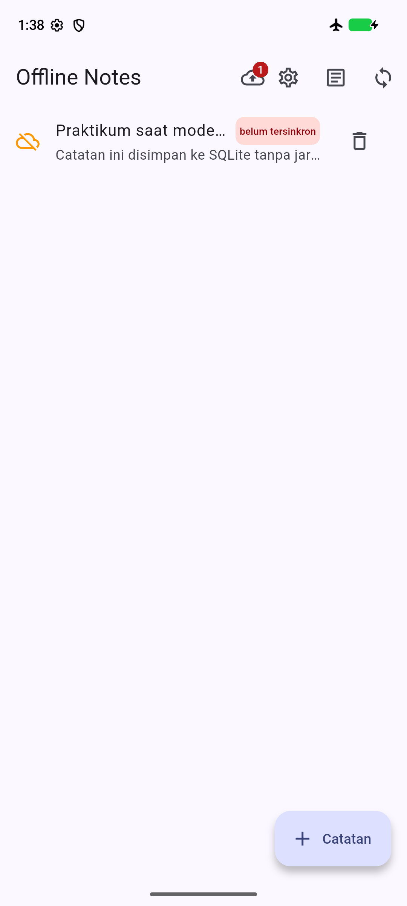
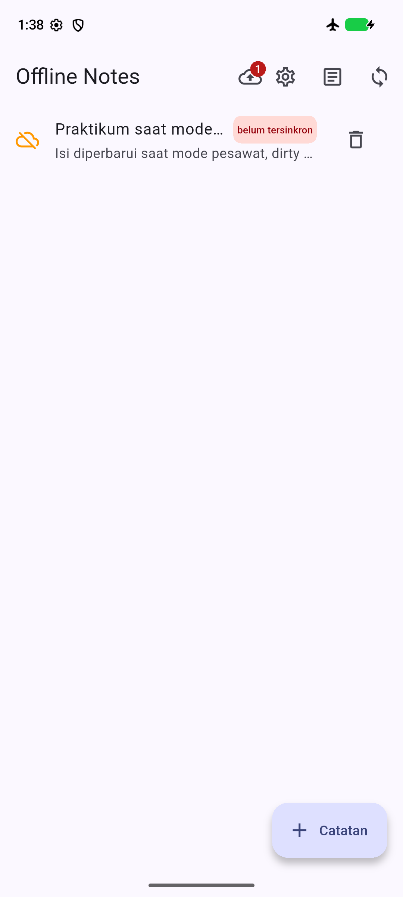
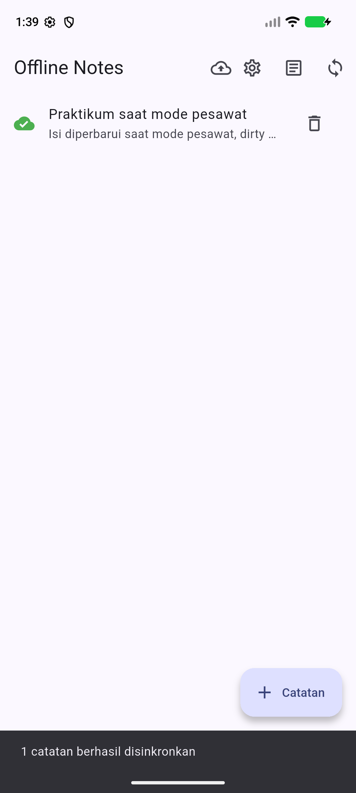

# Verifikasi praktikum

Tanggal: 5 Oktober 2026. Windows, Flutter 3.41.9, Dart 3.11.5, Android Emulator Pixel_6a, device emulator-5554.

## Test otomatis

`flutter test --reporter expanded`: **19 test lulus** (3 model/konflik, 2 provider fake, 1 preferensi, 2 cache provider, 3 SQLite nyata melalui FFI, 6 sync dan 2 widget). [Log test](test-results.txt) dan [log analisis](analyze-results.txt) menyimpan hasil sebenarnya. Analisis: No issues found.

Build aplikasi biasa (lib/main.dart), di luar APK test integrasi: `flutter build apk --debug --no-pub` berhasil. [Hasil build](build-results.txt). APK berada di build/app/outputs/flutter-apk/app-debug.apk dan tidak dimasukkan Git.

## Mengulang bukti

Gunakan emulator khusus demo dengan applicationId com.example.offline_notes dan data bersih. Gunakan database server baru supaya id/catatan sesi lama tidak memengaruhi hasil. Jangan menghapus data aplikasi yang berisi catatan penting.

```powershell
python tools/demo_server.py --db build/evidence-server.sqlite
```

Di terminal lain:

```powershell
flutter drive -d emulator-5554 --driver=test_driver/evidence_driver.dart --target=integration_test/offline_evidence_test.dart
```

Driver memakai handshake file di cache aplikasi, mengatur mode pesawat lewat ADB, mematikan Wi-Fi/data dan memeriksa airplane_mode_on. Screenshot berasal dari adb exec-out screencap -p. Setelah bukti offline, driver mematikan mode pesawat untuk sync HTTP. ADB tetap tersedia walau radio mati. Switch Paksa mode offline hanya simulasi tambahan, bukan bukti mode pesawat.

| Screenshot | Bukti |
|---|---|
| 01-daftar-mode-pesawat.png | Catatan SQLite dan dirty saat airplane_mode_on=1 |
| 02-dirty-sebelum-sync.png | Dirty tetap aktif sesudah percobaan sync offline |
| 03-bacaan-cache-offline.png | Bacaan tampil dari cache SQLite |
| 04-tema-gelap.png | Tema gelap |
| 05-tema-terang.png | Tema terang |
| 06-dirty-sesudah-sync.png | Online, ACK server diterima, dirty hilang |

File .txt dengan nama sama mencatat status mode pesawat. Skenario integrasi lulus: log berakhir dengan All tests passed (angka +2 di runner mencakup tearDownAll, satu skenario aplikasi). [Log integrasi](integration-results.txt).

Gambar 01 sampai 05 memiliki airplane_mode_on=1; gambar 06 memiliki airplane_mode_on=0. Semua gambar diperiksa secara visual: ikon pesawat terlihat pada bukti offline, badge 1 dan label belum tersinkron bertahan sebelum sync, lalu hilang sesudah ACK. Respons server memperlihatkan catatan id=1 bersih dan tombstone id=2 bersih. [Bukti data server](server-ack-evidence.json).

| Mode pesawat | Sebelum sync | Sesudah sync |
|---|---|---|
|  |  |  |

Emulator menggunakan image Android 17 preview (API 37.2, page size 16k). RAM 2 GB membuat proses perangkat terhenti pada percobaan awal; pengujian akhir memakai cold boot dengan 4 GB. Error handshake awal diperbaiki dengan memakai code_cache, sesuai Directory.systemTemp Android. Kegagalan lingkungan awal tidak dicatat sebagai hasil lulus.

Test widget tambahan memeriksa form pada lebar 320 px, validasi melalui Tab/Enter, penutupan Escape, serta daftar dengan judul panjang pada tema terang dan gelap. Kontras teks dirty badge di kedua tema diuji minimal 4.5:1. Hasil lulus ada pada log 19 test.

Kontrol yang dioperasikan: tambah, judul kosong, simpan, detail, edit, kembali, posts, tema, offline paksa, sync offline/online, batal tambah, batal hapus, konfirmasi hapus dan sync tombstone.
