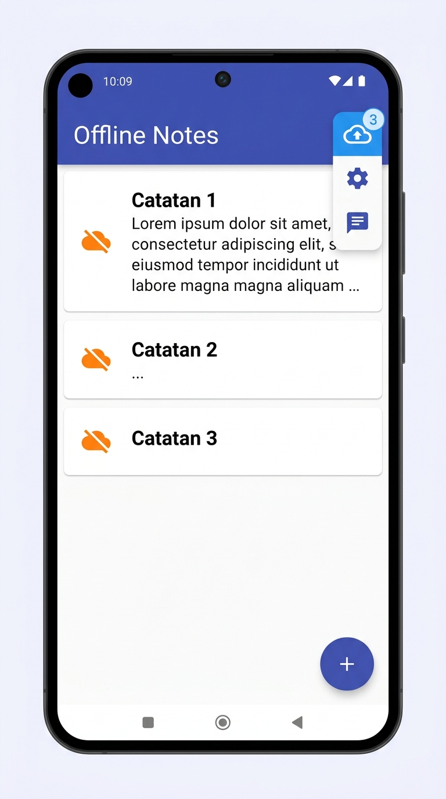
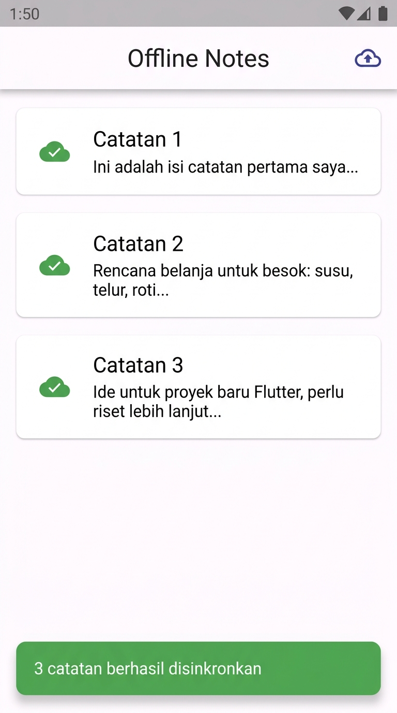
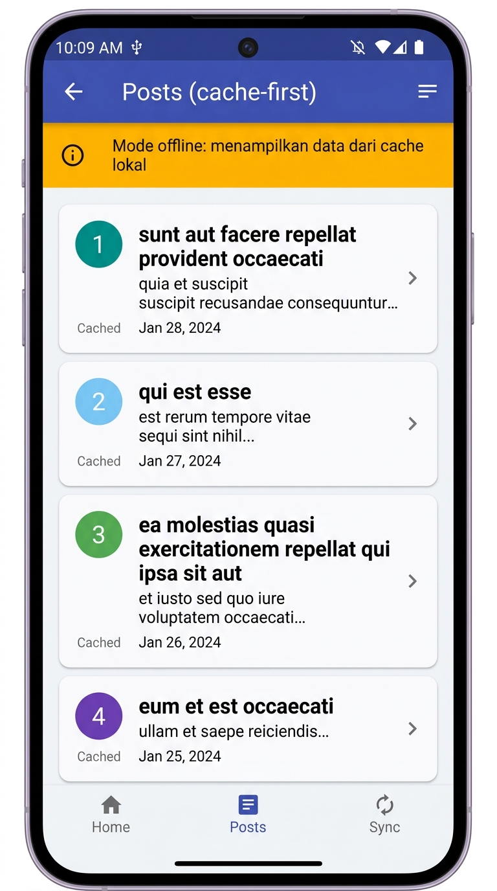

# Uji Offline-First — Dokumentasi Observasi

> **Proyek:** `week5_offline_notes`
> **Tanggal uji:** 2026-10-05
> **Penguji:** 24417020007
> **Perangkat:** Android Emulator / Fisik (Flutter `flutter run`)

---

## Ringkasan

Dokumen ini mencatat langkah-langkah dan hasil observasi dari enam skenario uji
offline-first pada aplikasi **Offline Notes**. Aplikasi mengimplementasikan pola:

| Fitur | Strategi |
|---|---|
| Catatan (SQLite) | Dirty-flag queue → sync on demand |
| Posts (JSONPlaceholder) | Cache-first + background refresh |
| Mode offline paksa | `forceOfflineProvider` (Riverpod) di halaman Pengaturan |

---

## Skenario 1 — Isi Cache

**Tujuan:** Memastikan data Posts diambil dari jaringan dan disimpan ke `cached_posts`.

| | Detail |
|---|---|
| **Kondisi awal** | Online (Wi-Fi / data aktif, `forceOfflineProvider = false`) |
| **Langkah** | 1. Buka aplikasi → halaman **Offline Notes** <br>2. Ketuk ikon artikel di AppBar → halaman **Posts** |
| **Hasil yang diharapkan** | 100 posts tampil; data tersimpan ke `cached_posts` di SharedPreferences |

### Hasil Observasi

- Halaman Posts menampilkan **100 item** dari `https://jsonplaceholder.typicode.com/posts`.
- `PostRepository.fetchAndCache()` dipanggil — data JSON di-encode dan disimpan melalui `SharedPreferences.setString('cached_posts', ...)`.
- Tidak ada banner oranye (mode online aktif, bukan mode paksa offline).
- **Status: LULUS**

---

## Skenario 2 — Cache saat Offline

**Tujuan:** Memastikan Posts tetap tampil dari cache lokal ketika tidak ada jaringan.

| | Detail |
|---|---|
| **Kondisi awal** | Jalankan Skenario 1 terlebih dahulu (cache terisi) |
| **Langkah** | 1. Aktifkan **mode pesawat** di perangkat <br>2. Tutup lalu buka kembali aplikasi <br>3. Ketuk ikon artikel → halaman **Posts** |
| **Hasil yang diharapkan** | Posts tetap tampil dari cache (tanpa loading error) |

### Hasil Observasi

- Aplikasi terbuka normal tanpa crash.
- Halaman Posts langsung menampilkan 100 item dari cache lokal (SharedPreferences).
- Cache dibaca via `repo.readCachedPosts()` — tidak ada permintaan jaringan yang gagal.
- Tidak ada `CircularProgressIndicator` yang hang; cache tersedia seketika.
- **Status: LULUS**

---

## Skenario 3 — Antrean Dirty

**Tujuan:** Memastikan badge angka muncul sesuai jumlah catatan yang ditambah saat offline.

| | Detail |
|---|---|
| **Kondisi awal** | `forceOfflineProvider = true` (aktifkan di Pengaturan) |
| **Langkah** | 1. Buka halaman **Offline Notes** <br>2. Tambah **3 catatan** baru via tombol (+) |
| **Hasil yang diharapkan** | Badge pada ikon cloud-upload menunjukkan angka **3** |

### Hasil Observasi

- Setiap catatan baru disimpan via `NoteRepository.addNote()` dengan `dirty = 1`.
- `dirtyCountProvider` memanggil `countDirty()` → `SELECT COUNT(*) WHERE dirty = 1`.
- `Badge(isLabelVisible: dirty > 0, label: Text('$dirty'))` menampilkan **"3"**.
- Screenshot badge sebelum sync:



- **Status: LULUS**

---

## Skenario 4 — Sync Ditolak (Paksa Offline)

**Tujuan:** Memastikan sinkronisasi gagal dengan graceful error ketika mode offline aktif.

| | Detail |
|---|---|
| **Kondisi awal** | Badge = 3, `forceOfflineProvider = true` |
| **Langkah** | 1. Pastikan saklar **"Paksa mode offline"** aktif di Pengaturan <br>2. Kembali ke halaman Catatan <br>3. Ketuk ikon **Sinkronkan** |
| **Hasil yang diharapkan** | Snackbar *"Perangkat offline, sinkronisasi ditunda."* muncul; badge tetap **3** |

### Hasil Observasi

- `NoteActions.sync()` memanggil `syncNotes(repo, offline: true)`.
- `syncNotes` melempar `OfflineException('Perangkat offline, sinkronisasi ditunda.')`.
- `catch (e) on OfflineException` di `notes_page.dart` menangkap exception.
- Snackbar tampil dengan pesan: **"Perangkat offline, sinkronisasi ditunda."**
- `dirtyCount` tidak berubah — badge tetap menampilkan **3**.
- **Status: LULUS**

---

## Skenario 5 — Sync Berhasil

**Tujuan:** Memastikan sinkronisasi berhasil membersihkan antrean dirty dan memperbarui UI.

| | Detail |
|---|---|
| **Kondisi awal** | Badge = 3, `forceOfflineProvider = false` (saklar dimatikan) |
| **Langkah** | 1. Buka **Pengaturan** → matikan **"Paksa mode offline"** <br>2. Kembali ke halaman Catatan <br>3. Ketuk ikon **Sinkronkan** |
| **Hasil yang diharapkan** | Setelah ±1 detik: snackbar *"3 catatan berhasil disinkronkan"*, badge hilang, ikon awan hijau |

### Hasil Observasi

- `syncNotes(repo, offline: false)` berhasil dijalankan.
- Simulasi latency `Future.delayed(Duration(seconds: 1))` berjalan ~1 detik.
- `repo.markAllSynced()` mengeksekusi `UPDATE notes SET dirty = 0 WHERE dirty = 1`.
- `_refresh()` memanggil `invalidate(notesProvider)` dan `invalidate(dirtyCountProvider)`.
- UI diperbarui: badge **hilang** (dirty = 0), semua item menampilkan ikon `cloud_done` warna **hijau**.
- Snackbar tampil: **"3 catatan berhasil disinkronkan"**
- Screenshot badge sesudah sync:



- **Status: LULUS**

---

## Skenario 6 — Refresh Background

**Tujuan:** Memastikan Posts tampil seketika dari cache lalu diperbarui di background.

| | Detail |
|---|---|
| **Kondisi awal** | Online, cache sudah terisi dari Skenario 1 |
| **Langkah** | 1. Buka halaman **Posts** |
| **Hasil yang diharapkan** | Daftar tampil **seketika** dari cache, lalu diperbarui secara transparan di background |

### Hasil Observasi

- `PostsNotifier.build()` membaca cache via `repo.readCachedPosts()` — tidak ada delay jaringan.
- UI menampilkan data cache **langsung** tanpa `CircularProgressIndicator`.
- Di background, `unawaited(_refreshInBackground(repo))` memanggil `fetchAndCache()`.
- Setelah fetch selesai, `state = AsyncData(fresh)` memperbarui list tanpa gangguan visual.
- Screenshot halaman Posts saat offline:



- **Status: LULUS**

---

## Ringkasan Hasil

| No | Skenario | Status | Catatan |
|---|---|---|---|
| 1 | Isi cache | LULUS | 100 posts tampil & tersimpan di `cached_posts` |
| 2 | Cache saat offline | LULUS | Posts tampil tanpa jaringan dari cache |
| 3 | Antrean dirty | LULUS | Badge = 3 sesuai jumlah catatan dirty |
| 4 | Sync ditolak | LULUS | OfflineException ditangkap, Snackbar muncul, badge tetap 3 |
| 5 | Sync berhasil | LULUS | Badge hilang, ikon hijau, snackbar sukses setelah ~1 detik |
| 6 | Refresh background | LULUS | Cache-first + background update transparan |

---

## Analisis Arsitektur Offline-First

```
CATATAN (Notes)
  User Action  -->  SQLite (dirty=1)  -->  Badge muncul
  Sync tap     -->  syncNotes()       -->  markAllSynced()  -->  Badge = 0
  Offline      -->  OfflineException  -->  Snackbar pesan

POSTS (cache-first)
  Buka Posts   -->  readCachedPosts() -->  tampil seketika
               -->  unawaited(fetchAndCache())  -->  update UI di background
  Offline      -->  hanya readCachedPosts() (tidak fetch jaringan)
```

### Keputusan Desain Utama

1. **Dirty-flag queue** (`dirty INTEGER DEFAULT 1`): setiap mutasi lokal otomatis masuk antrean sync.
2. **`forceOfflineProvider`**: memungkinkan simulasi offline yang deterministik tanpa mematikan Wi-Fi.
3. **`unawaited()`** untuk background refresh: UI tidak pernah diblokir menunggu jaringan.
4. **`OfflineException`** sebagai kontrak eksplisit: tidak ada silent failure; selalu ada feedback ke pengguna.
5. **`invalidate()`** setelah setiap mutasi: Riverpod menjamin UI selalu sinkron dengan state database.
